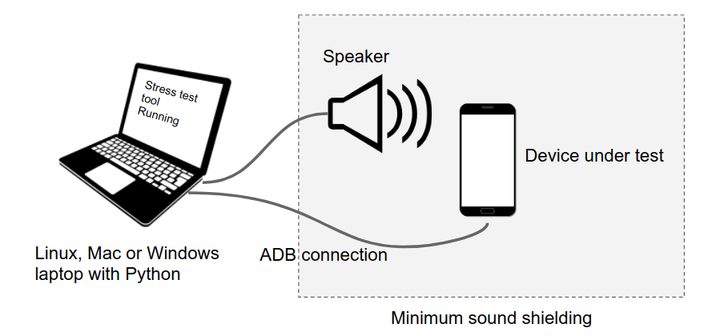

# OpenHST : Open sourced Hotword Stress Test tool

Hotword stress test tool is a python script to measure the Google Hotword
performance on Android devices with simple test set up. The goal of OpenHST is
making Google Hotword Stress Test tool as an open source project so that Android
Partners can easily adapt on their development.

## Overview

## Prerequsite

Before setting up your HST test environment, please make sure to meet following
preconditions.

*   DSP hotword capability on test device (android handset)
*   ADB connection between the test server and android handset
*   Internet connection on android handset
*   No screen lock setting on android handset
*   Python 3.x installed test machine (Linux, Mac, Windows)
*   Install GNU make(3.81 above) on test machine (Linux, Mac, Windows)

## Test environment setup

Please follow below steps to set up HST on your test machine and make sure that
no error popped up during the installation.

__Linux & Mac__

1.  make start
1.  make proto-compile
1.  source env/bin/activate
1.  ./start_venv.sh

__Windows__

1.  make start
1.  make proto-compile
1.  .\env\Scripts\activate
1.  .\start_venv.bat
1.  pip3 install -r requirements.txt

## Documentation

Read our [detailed documentation](docs/OpenHST.pdf) to learn how to run the
Hotword Stress Test.

## Contacts

Join our [mailing list](https://groups.google.com/g/openhst) for discussions and
announcements.
